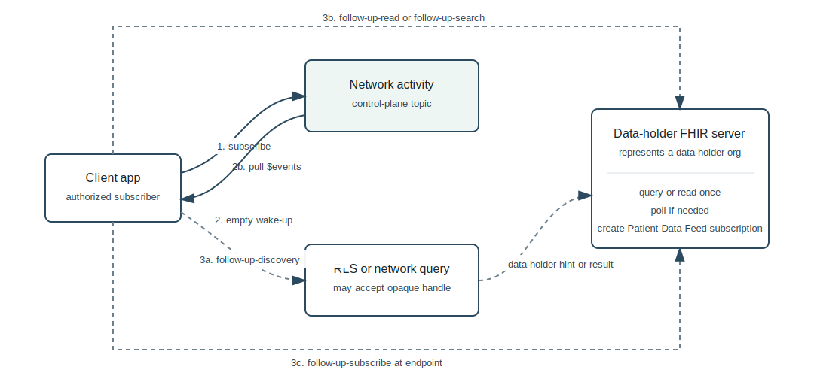
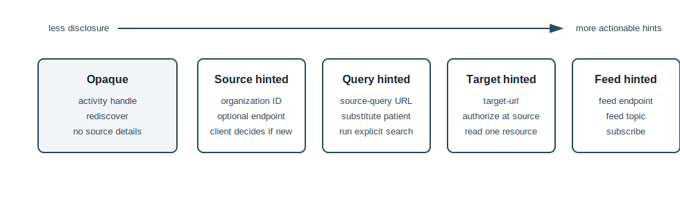

# CMS Aligned Networks: Network Activity Notifications

**CMS Interoperability Framework - Subscriptions Workgroup**

*Draft for Discussion*

## 1. Purpose

This proposal defines a small, network-level notification capability: a CMS-Aligned Network can tell an authorized client that patient-relevant activity may exist, and can optionally include hints about how the client should follow up.

The activity notification is a control-plane signal. It is not an encounter notification, an appointment notification, or a clinical payload. It helps a client decide whether to run discovery, query a network service, query a source, or subscribe to a source-level feed.

This gives the ecosystem two complementary MVPs:

| MVP | Where it lives | What it does |
|-----|----------------|--------------|
| Network-level activity notifications | CMS-Aligned Network | Tells a client that something relevant may have changed, with optional source and action hints |
| Source-level Patient Data Feed subscriptions | EHR, provider endpoint, or provider-hosted network endpoint | Delivers encounter and appointment notifications using the US Core Patient Data Feed topic |

Together, these reduce blind polling. The network can say "look here" or "run a narrowed follow-up," and the source endpoint can deliver detailed encounter and appointment events.



## 2. Design Principles

1. **No clinical content in the network signal.** The notification does not contain Encounter, Appointment, diagnosis, reason-for-visit, or clinical resource identifiers.
2. **Progressive disclosure.** A conformant notification can be fully opaque. A network may add organization, endpoint, resource-type, time-window, or feed hints when policy and available data allow.
3. **Hints, not commands.** Suggested actions tell the client what the network believes is useful. The client still chooses what to do.
4. **Opaque handles enable narrowed follow-up.** The network can include an opaque `activity-handle` that the client passes unchanged into follow-up calls. Downstream services can use the handle to narrow processing without revealing why.
5. **No app-specific source memory required at the network.** The network can identify a source when it can. The client decides whether that source is new, known, already subscribed, or irrelevant.
6. **Existing RLS remains valid.** Activity notifications can point clients back to existing discovery/RLS flows, or provide enough detail to bypass a broad RLS query.
7. **Authorization is not solved here.** This specification assumes the network sends activity notifications only when the client is authorized to receive that signal.

## 3. What A Network Might Observe

A network may learn about patient-relevant activity from many operational signals, including:

- A participant sends an ADT, scheduling, or other event feed to the network.
- A participant's broker or gateway receives a source-level Patient Data Feed event.
- A record locator or discovery result changes for a patient.
- A participant publishes a new FHIR endpoint or feed capability.
- A peer network reports that a patient-relevant source exists.
- A permitted administrative workflow indicates that a source may now have data.

This proposal does not standardize how the network learns the activity. It only standardizes the client-facing notification pattern.

## 4. Actors

| Actor | Description |
|-------|-------------|
| **Client** | Application that wants patient-relevant activity signals. The initial audience is patient-facing Individual Access Services apps, but the model is not limited to them. |
| **Network Activity Endpoint** | FHIR endpoint operated by a CMS-Aligned Network. The client subscribes here for activity notifications. |
| **Discovery/RLS Service** | Existing network service that helps the client find relevant sources. This may be FHIR, XCPD/RLS, directory-based, or another network-defined flow. |
| **Source Endpoint** | FHIR endpoint where the client can query or read clinical resources, subject to source authorization. |
| **Source Feed Endpoint** | FHIR endpoint that supports the US Core Patient Data Feed topic for encounter and appointment notifications. This may be operated by the provider or hosted by the network on the provider's behalf. |

## 5. Topic

This proposal defines one network-level topic:

```text
https://cms.gov/fhir/SubscriptionTopic/network-activity
```

The topic's focus resource is `Parameters`, delivered as `full-resource` content in a FHIR R4 Subscriptions Backport notification bundle.

The use of `Parameters` is intentional. It lets the proposal define a small logical message without requiring new FHIR resource types.

## 6. Subscription Setup

The client authorizes at the Network Activity Endpoint. The token response includes a network-scoped patient context, following SMART conventions:

```json
{
  "access_token": "eyJ...",
  "token_type": "bearer",
  "expires_in": 3600,
  "scope": "system/Subscription.crud",
  "patient": "network-patient-123"
}
```

The client creates a subscription filtered to that patient:

```http
POST https://network.example.org/fhir/Subscription
Authorization: Bearer {access_token}
Content-Type: application/fhir+json
```

```json
{
  "resourceType": "Subscription",
  "status": "requested",
  "reason": "Notify when patient-relevant network activity is observed",
  "criteria": "https://cms.gov/fhir/SubscriptionTopic/network-activity",
  "_criteria": {
    "extension": [
      {
        "url": "http://hl7.org/fhir/uv/subscriptions-backport/StructureDefinition/backport-filter-criteria",
        "valueString": "Parameters?patient=network-patient-123"
      }
    ]
  },
  "channel": {
    "type": "rest-hook",
    "endpoint": "https://app.example.org/fhir/network-activity",
    "payload": "application/fhir+json",
    "_payload": {
      "extension": [
        {
          "url": "http://hl7.org/fhir/uv/subscriptions-backport/StructureDefinition/backport-payload-content",
          "valueCode": "full-resource"
        }
      ]
    }
  }
}
```

The `patient` filter uses the patient id returned by the Network Activity Endpoint. It is not a cross-network patient identifier.

## 7. Activity Message Model

Every activity notification has:

- An `activity-id` for deduplication.
- The patient context for routing.
- An `activity-type`.
- The time the network observed the activity.
- One or more suggested client actions.

Most other fields are optional.



### 7.1 Logical TypeScript Model

The logical model is also available as [schema/network-activity.ts](schema/network-activity.ts).

```ts
export interface NetworkActivitySignal {
  topic: Url;
  activityId: string;
  patient: PatientContext;
  observedAt: FhirInstant;
  activityType: ActivityType;
  detailLevel: DetailLevel;
  handle?: OpaqueActivityHandle;
  source?: SourceHint;
  activityWindow?: TimeWindow;
  resourceTypes?: FhirResourceType[];
  suggestedActions: SuggestedAction[];
  extensions?: Record<string, unknown>;
}

export type ClientActionCode =
  | "rediscover"
  | "query-network"
  | "query-source"
  | "subscribe-source";
```

### 7.2 FHIR Parameters Mapping

| Parameter | Cardinality | Type | Meaning |
|-----------|-------------|------|---------|
| `activity-id` | 1..1 | `valueString` | Stable id for deduplication. |
| `patient` | 1..1 | `valueString` | Endpoint-scoped patient id or patient handle known to the subscriber. |
| `activity-type` | 1..1 | `valueCode` | Broad type of signal. Minimum value is `activity-detected`. |
| `detail-level` | 1..1 | `valueCode` | `opaque`, `source-hinted`, `query-hinted`, or `feed-hinted`. |
| `observed-at` | 1..1 | `valueInstant` | When the network observed the activity. |
| `activity-handle` | 0..1 | `valueString` | Opaque handle the client may pass into follow-up actions. |
| `activity-handle-expires` | 0..1 | `valueInstant` | Optional expiration for the handle. |
| `source-organization` | 0..1 | `resource` | Minimal FHIR `Organization` identifying the source, usually by NPI, CCN, or network identifier. |
| `source-endpoint` | 0..1 | `valueUrl` | FHIR base URL where source query or read may occur. |
| `feed-endpoint` | 0..1 | `valueUrl` | FHIR base URL supporting source-level Patient Data Feed subscriptions. |
| `activity-window-start` | 0..1 | `valueInstant` | Optional lower bound for likely relevant activity. |
| `activity-window-end` | 0..1 | `valueInstant` | Optional upper bound for likely relevant activity. |
| `resource-type` | 0..* | `valueCode` | Optional resource types worth checking, such as `Encounter` or `Appointment`. |
| `suggested-action` | 1..* | `part` | One suggested follow-up action. |

### 7.3 Activity Types

| Code | Meaning |
|------|---------|
| `activity-detected` | Generic signal. Something patient-relevant may have changed, but the network is not disclosing more. |
| `care-relationship-detected` | The network believes a source may now hold data for the patient. The client decides whether the source is new. |
| `source-activity-detected` | The network believes an identified source has new or changed patient-relevant activity. |
| `feed-available` | A relevant source feed endpoint may be available. |
| `capability-changed` | A source or network capability changed in a way that may affect follow-up. |

Networks may define additional codes by agreement, but clients should not need custom codes for the base workflow.

### 7.4 Detail Levels

| Code | Meaning |
|------|---------|
| `opaque` | No source or query detail is disclosed. The client follows a generic action such as `rediscover` or `query-network`. |
| `source-hinted` | The notification identifies a possible source organization or endpoint. |
| `query-hinted` | The notification includes enough information to narrow a query, such as resource types or a time window. |
| `feed-hinted` | The notification includes a source feed endpoint where the client may create a Patient Data Feed subscription. |

Detail level is descriptive, not a security label. Authorization and disclosure policy are still enforced by the network and downstream sources.

## 8. Suggested Actions

Suggested actions are finite so clients can implement predictable behavior. They are still hints, not commands.

| Action | Meaning | Common parameters |
|--------|---------|-------------------|
| `rediscover` | Run the network's existing discovery/RLS flow. | `activity-handle`, `discovery-hint`, optional network endpoint |
| `query-network` | Query a network service for a narrowed result. | `activity-handle`, endpoint, operation or query template |
| `query-source` | Query an identified source endpoint. | source endpoint, resource types, optional since time, `activity-handle` |
| `subscribe-source` | Create or refresh a source-level Patient Data Feed subscription. | feed endpoint, topic, resource types, `activity-handle` |

Suggested actions may be ranked. A client may take the first action it supports, take multiple actions, or ignore an action that is inconsistent with its own policy or state.

Actions that name a source do not carry a source-scoped patient id. If the client does not already have an authorized source context, it authorizes at the source first and uses the patient context returned by that source.

### 8.1 Opaque Activity Handles

An `activity-handle` is an opaque value scoped to the network, client, patient, and activity. The client does not inspect it. The client passes it unchanged when a suggested action says to do so.

The handle can help downstream services reduce fan-out. For example, if a broad RLS query would usually touch hundreds of sites, the network can use the handle to know that only one or two sites are plausible for this particular activity. The client does not need to know those sites unless the network chooses to disclose them.

The handle is not:

- A patient identifier.
- A clinical resource identifier.
- A consent artifact.
- A guarantee that data exists.
- Authorization to retrieve data.

### 8.2 Passing Handles In Follow-Up Calls

This proposal does not require one universal binding for `activity-handle`. The suggested action can name how the handle should be passed, such as `handle-parameter: activity-handle`.

For FHIR operations, the handle can be a `Parameters` input named by `handle-parameter`. For HTTP or directory workflows, the same value can be passed as a documented query parameter, body parameter, or header. The receiving service decides whether and how to use it.

If the client cannot pass the handle in the requested way, it may still perform the follow-up without the handle. The result may be broader or slower.

## 9. Examples

### 9.1 Minimal Opaque Notification

The network discloses no source detail. The app should rediscover or query the network, passing the handle.

```json
{
  "resourceType": "Bundle",
  "type": "subscription-notification",
  "timestamp": "2026-04-29T16:00:00Z",
  "entry": [
    {
      "fullUrl": "urn:uuid:status-1",
      "resource": {
        "resourceType": "SubscriptionStatus",
        "status": "active",
        "type": "event-notification",
        "eventsSinceSubscriptionStart": 42,
        "notificationEvent": [
          {
            "eventNumber": 42,
            "timestamp": "2026-04-29T15:59:50Z",
            "focus": {
              "reference": "urn:uuid:activity-1",
              "type": "Parameters"
            }
          }
        ],
        "subscription": {
          "reference": "https://network.example.org/fhir/Subscription/sub-123"
        },
        "topic": "https://cms.gov/fhir/SubscriptionTopic/network-activity"
      }
    },
    {
      "fullUrl": "urn:uuid:activity-1",
      "resource": {
        "resourceType": "Parameters",
        "parameter": [
          { "name": "activity-id", "valueString": "act-20260429-000042" },
          { "name": "patient", "valueString": "network-patient-123" },
          { "name": "activity-type", "valueCode": "activity-detected" },
          { "name": "detail-level", "valueCode": "opaque" },
          { "name": "observed-at", "valueInstant": "2026-04-29T15:59:50Z" },
          { "name": "activity-handle", "valueString": "opaque-short-lived-handle" },
          {
            "name": "suggested-action",
            "part": [
              { "name": "code", "valueCode": "rediscover" },
              { "name": "rank", "valueInteger": 1 },
              { "name": "activity-handle", "valueString": "opaque-short-lived-handle" },
              { "name": "handle-parameter", "valueString": "activity-handle" }
            ]
          }
        ]
      }
    }
  ]
}
```

### 9.2 Source And Feed Hinted Notification

The network can disclose an organization and a source feed endpoint. The client may skip broad RLS and create a Patient Data Feed subscription at the feed endpoint.

```json
{
  "resourceType": "Parameters",
  "parameter": [
    { "name": "activity-id", "valueString": "act-20260429-000043" },
    { "name": "patient", "valueString": "network-patient-123" },
    { "name": "activity-type", "valueCode": "care-relationship-detected" },
    { "name": "detail-level", "valueCode": "feed-hinted" },
    { "name": "observed-at", "valueInstant": "2026-04-29T16:10:00Z" },
    { "name": "activity-handle", "valueString": "opaque-source-handle" },
    {
      "name": "source-organization",
      "resource": {
        "resourceType": "Organization",
        "identifier": [
          {
            "system": "http://hl7.org/fhir/sid/us-npi",
            "value": "1234567890"
          }
        ],
        "name": "Valley Clinic"
      }
    },
    {
      "name": "feed-endpoint",
      "valueUrl": "https://valley-clinic.example.org/fhir"
    },
    { "name": "resource-type", "valueCode": "Encounter" },
    { "name": "resource-type", "valueCode": "Appointment" },
    {
      "name": "suggested-action",
      "part": [
        { "name": "code", "valueCode": "subscribe-source" },
        { "name": "rank", "valueInteger": 1 },
        {
          "name": "topic",
          "valueUrl": "http://hl7.org/fhir/us/core/SubscriptionTopic/patient-data-feed"
        },
        {
          "name": "feed-endpoint",
          "valueUrl": "https://valley-clinic.example.org/fhir"
        },
        { "name": "activity-handle", "valueString": "opaque-source-handle" }
      ]
    }
  ]
}
```

### 9.3 Query A Source The Client May Already Know

The network does not need to know whether the app already knows the source. It identifies the source. The app decides whether to query, subscribe, ignore, or treat it as already covered.

```json
{
  "resourceType": "Parameters",
  "parameter": [
    { "name": "activity-id", "valueString": "act-20260429-000044" },
    { "name": "patient", "valueString": "network-patient-123" },
    { "name": "activity-type", "valueCode": "source-activity-detected" },
    { "name": "detail-level", "valueCode": "query-hinted" },
    { "name": "observed-at", "valueInstant": "2026-04-29T16:25:00Z" },
    {
      "name": "source-organization",
      "resource": {
        "resourceType": "Organization",
        "identifier": [
          {
            "system": "http://hl7.org/fhir/sid/us-npi",
            "value": "1234567890"
          }
        ],
        "name": "Valley Clinic"
      }
    },
    {
      "name": "source-endpoint",
      "valueUrl": "https://valley-clinic.example.org/fhir"
    },
    { "name": "activity-window-start", "valueInstant": "2026-04-29T15:00:00Z" },
    { "name": "resource-type", "valueCode": "Encounter" },
    {
      "name": "suggested-action",
      "part": [
        { "name": "code", "valueCode": "query-source" },
        { "name": "rank", "valueInteger": 1 },
        {
          "name": "source-endpoint",
          "valueUrl": "https://valley-clinic.example.org/fhir"
        },
        { "name": "resource-type", "valueCode": "Encounter" },
        { "name": "since", "valueInstant": "2026-04-29T15:00:00Z" }
      ]
    }
  ]
}
```

### 9.4 Network Query With Fan-Out Reduction

The notification is opaque, but the follow-up handle lets the network return a narrowed result without the app learning why the result was narrow.

```json
{
  "resourceType": "Parameters",
  "parameter": [
    { "name": "activity-id", "valueString": "act-20260429-000045" },
    { "name": "patient", "valueString": "network-patient-123" },
    { "name": "activity-type", "valueCode": "activity-detected" },
    { "name": "detail-level", "valueCode": "opaque" },
    { "name": "observed-at", "valueInstant": "2026-04-29T16:30:00Z" },
    { "name": "activity-handle", "valueString": "opaque-downscope-handle" },
    {
      "name": "suggested-action",
      "part": [
        { "name": "code", "valueCode": "query-network" },
        { "name": "rank", "valueInteger": 1 },
        {
          "name": "network-endpoint",
          "valueUrl": "https://network.example.org/fhir/$resolve-activity"
        },
        { "name": "activity-handle", "valueString": "opaque-downscope-handle" },
        { "name": "handle-parameter", "valueString": "activity-handle" }
      ]
    }
  ]
}
```

## 10. Relationship To RLS And Discovery

Activity notifications do not replace RLS. They add a streaming front door to discovery.

A network may:

- Send an opaque notification that causes the client to run its existing RLS workflow.
- Include an `activity-handle` so the RLS workflow can be narrowed.
- Include `source-organization` so the client can decide whether it already knows the source.
- Include `source-endpoint` or `feed-endpoint` so the client can skip broad discovery.

This makes the same topic useful across networks with different policy and technical capabilities. A network that cannot disclose source detail can still send useful signals. A network that can disclose more can reduce client work and avoid unnecessary fan-out.

## 11. Relationship To Patient Data Feed

The source-level data plane should use the US Core Patient Data Feed topic:

```text
http://hl7.org/fhir/us/core/SubscriptionTopic/patient-data-feed
```

Activity notifications help the client decide where to establish or refresh those source-level subscriptions.

For example:

1. The client subscribes to `network-activity` at the network.
2. The network sends a `feed-hinted` activity notification with a source feed endpoint.
3. The client authorizes at that endpoint.
4. The client creates a Patient Data Feed subscription there.
5. Encounter and appointment notifications flow directly from the source feed endpoint.

The network-level activity signal stays out of the clinical data path. The source endpoint remains responsible for source authorization, source-scoped patient identity, and clinical data access.

## 12. Delivery And Catch-Up

Delivery is best effort and at least once. Clients must be idempotent.

Notifications use standard FHIR subscription semantics:

- `eventNumber` lets clients detect gaps.
- Heartbeat notifications can help clients notice a broken delivery path.
- Clients may use standard subscription status and event history operations where supported.
- If a client suspects it missed activity notifications, it should run discovery or network query again using its own recovery policy.

This proposal does not require a network to maintain a complete activity log. Networks should document any event retention and catch-up behavior they support.

## 13. Security, Privacy, And Consent

This proposal deliberately does not define the ecosystem consent model.

Minimum assumptions:

- The network sends activity notifications only when policy authorizes the client to receive that kind of signal.
- Even an opaque activity notification may reveal sensitive information because it says something happened.
- Optional source hints may reveal more, especially if the organization or endpoint implies a sensitive service.
- A suggested action is not authorization to retrieve clinical data.
- Source endpoints enforce their own authorization and access control before returning clinical resources or accepting Patient Data Feed subscriptions.
- An `activity-handle` may narrow routing or processing, but it must not bypass authorization.

Networks should choose the least detailed notification that still gives the client a useful follow-up path.

## 14. Conformance Summary

### Network Activity Endpoint

- SHALL support the `network-activity` topic.
- SHALL accept subscriptions filtered to an endpoint-scoped patient context.
- SHALL deliver notification bundles using the FHIR R4 Subscriptions Backport format.
- SHALL include a `Parameters` focus resource with `activity-id`, `patient`, `activity-type`, `detail-level`, `observed-at`, and at least one `suggested-action`.
- SHALL NOT include clinical resources or clinical resource ids in the activity notification.
- SHOULD include an `activity-handle` when the suggested action can be down-scoped by follow-up services.
- MAY include source, endpoint, resource-type, time-window, and feed hints.

### Client

- SHALL treat suggested actions as hints.
- SHALL treat `activity-handle` as opaque.
- SHALL be idempotent for duplicate notifications.
- SHOULD detect event gaps using `eventNumber`.
- SHOULD use source-level Patient Data Feed subscriptions when a source feed endpoint is available and authorized.

### Source Feed Endpoint

- If offered as a source feed endpoint, SHALL support the US Core Patient Data Feed topic for Encounter.
- MAY support Appointment when available, and SHALL document whether Appointment is supported.
- SHALL enforce source authorization independently of the network activity notification.

## 15. Out Of Scope

- The consent and patient preference model.
- Identity proofing and token choreography.
- The transport and query syntax of existing RLS or discovery services.
- Cross-network peer signaling.
- How networks internally observe activity.
- Whether a source is new to a particular client.
- Guaranteed delivery of every network-observed activity.
- Detailed Patient Data Feed conformance, except as a referenced source-level capability.

## 16. Open Questions

1. Should the topic URL live under a CMS namespace, an HL7 namespace, or a future implementation guide namespace?
2. Should `activity-handle` have one required binding mechanism, such as an HTTP header, or remain protocol-specific?
3. Should the base action set include a status/check action for clients that already have a source subscription?
4. How much event retention should be expected for activity notification catch-up?
5. Should source hints use only FHIR `Organization`, or should they also allow FHIR `Endpoint` resources inline?

## References

- [US Core Patient Data Feed](https://build.fhir.org/ig/HL7/US-Core/patient-data-feed.html)
- [FHIR R4 Subscriptions Backport IG](https://build.fhir.org/ig/HL7/fhir-subscription-backport-ig/)
- [CMS Health Tech Ecosystem](https://www.cms.gov/health-technology-ecosystem)
